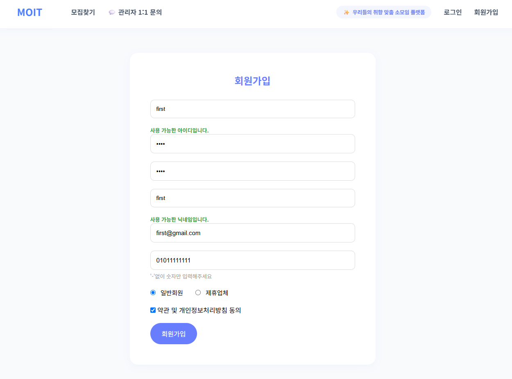
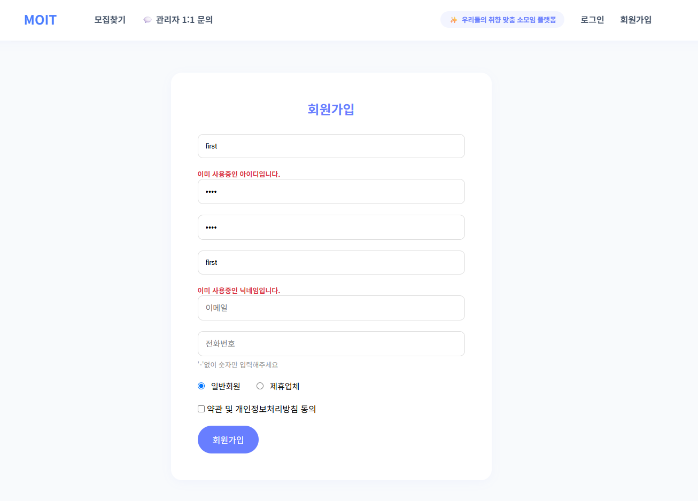
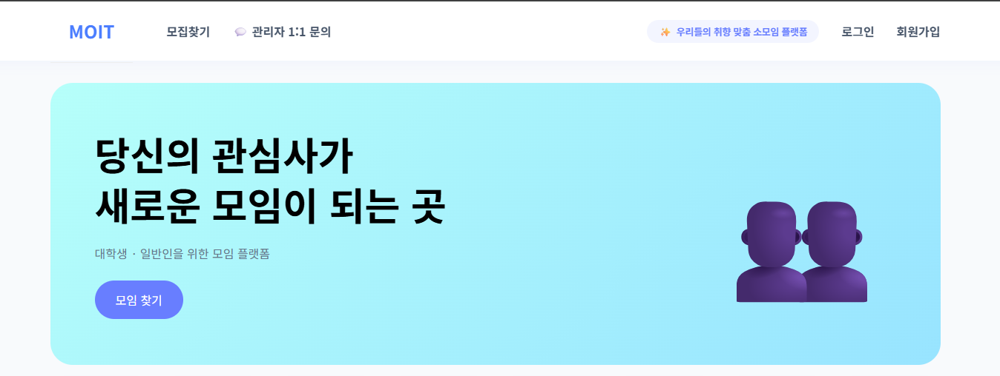
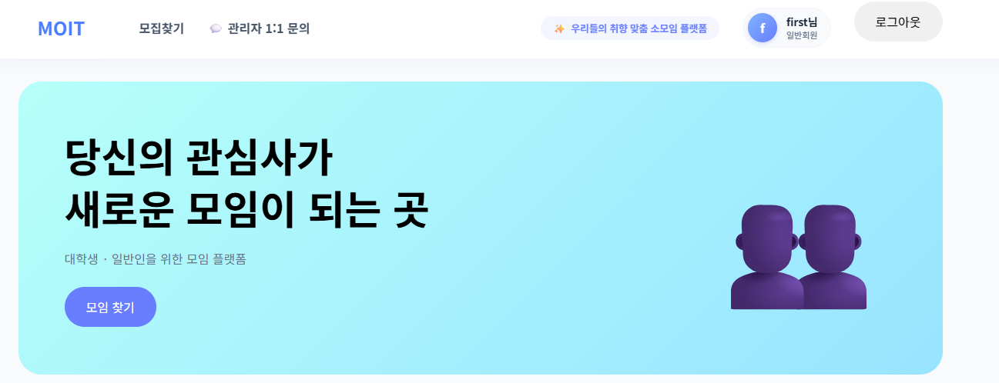

# 🚀 MOIT (모잇)


## 📌 프로젝트 소개

**MOIT(모잇)** 은 스터디, 프로젝트, 운동, 취미 활동 등  
**공통의 관심사와 목표를 가진 사람들이 모임을 만들고 참여할 수 있는 목적형 커뮤니티 플랫폼**입니다.

1차 프로젝트에서는 **Spring Framework와 MyBatis, MySQL을 기반으로 회원가입 및 로그인 등 기본적인 회원 관리 기능을 구현**하였습니다.

---

## 🎯 기획 의도

### 기획 배경

최근 청년 세대 사이에서는 단순한 친목 모임보다 스터디, 프로젝트, 운동, 취미 활동 등 특정 목적을 중심으로 모이는 **'목적형 모임' 문화**가 확산되고 있습니다.

하지만 다양한 소모임 정보가 여러 플랫폼에 분산되어 있어 사용자가 자신의 관심사와 목적에 맞는 모임을 찾기 어렵고, 원하는 활동에 참여하기까지 많은 시간과 노력이 필요합니다.

이에 **MOIT**은 관심사와 활동 목적을 기반으로 소모임을 쉽고 빠르게 탐색하고 참여할 수 있는 플랫폼을 제공하여, 사용자들이 보다 효율적으로 새로운 사람들과 연결될 수 있도록 기획되었습니다.

> MOIT은 단순한 친목 중심 플랫폼이 아닌, 같은 목표를 가진 사람들이 효율적으로 연결될 수 있는 목적형 커뮤니티 플랫폼을 지향합니다.

---

## 📅 프로젝트 개요

| 항목 | 내용 |
|---|---|
| 프로젝트명 | MOIT (모잇) |
| 개발 기간 | 2026.06.16 ~ 2026.06.22 |
| 개발 형태 | 팀 프로젝트 |
| 담당 영역 | 회원 관리 |
| 개발 목표 | 목적 기반 소모임 커뮤니티 플랫폼 구축 |

---

## 👤 담당 기능

### 1. 회원가입

- 회원가입 화면 구현
- 회원 정보 입력 및 저장
- 회원가입 유효성 검사
- 중복 회원 정보 확인
- MyBatis를 활용한 회원 데이터 처리

### 2. 로그인

- 로그인 화면 구현
- 회원 정보 검증
- 로그인 성공 및 실패 처리
- 세션 기반 로그인 상태 관리

### 3. 회원 정보 관리

- 회원 정보 조회
- 회원 정보 수정
- 회원 데이터를 MySQL과 연동하여 관리

---

## 🔄 회원 기능 처리 흐름

```text
[사용자]
   ↓
[회원가입 / 로그인]
   ↓
[Controller]
   ↓
[Service]
   ↓
[MyBatis Mapper]
   ↓
[MySQL]
```

사용자의 요청을 **Controller → Service → Mapper → DB** 구조로 처리하며
Spring MVC 기반의 계층형 웹 애플리케이션 구조를 경험하였습니다.

---

## 🛠 기술 스택

### Front-End

* HTML5
* CSS3
* JavaScript
* JSP

### Back-End

* Java
* Spring Framework
* Spring MVC
* MyBatis

### Database

* MySQL

### Server

* Apache Tomcat 9

### Collaboration

* Git
* GitHub
* Notion

---

## 💡 프로젝트 경험

* Spring MVC 기반 웹 애플리케이션 구조 이해
* Controller → Service → Mapper → DB 데이터 처리 흐름 경험
* MyBatis를 활용한 SQL 및 회원 데이터 처리 경험
* 회원가입 및 로그인 기능 구현 경험
* 세션 기반 로그인 및 사용자 인증 처리 경험
* Git을 활용한 팀 프로젝트 협업 경험

---

## 🎥 프로젝트 시연

### 회원가입 및 로그인

[](https://youtu.be/abWAlZ0a_GY)

<details>
<summary>📸 MOIT-V1 화면 보기</summary>

<br>


① 회원가입 — 기본 회원가입 화면

② 회원가입 — 입력 정보 검증

<br><br>


③ 헤더 — 로그인 전

④ 헤더 — 로그인 후

</details>

---

## 📈 프로젝트 발전

1차 프로젝트에서는 **Spring Framework + MyBatis + MySQL** 환경에서
회원가입과 로그인 등 기본적인 회원 관리 기능을 구현하였습니다.

