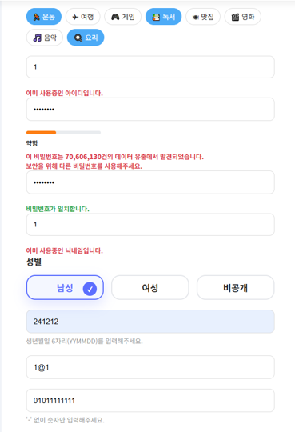
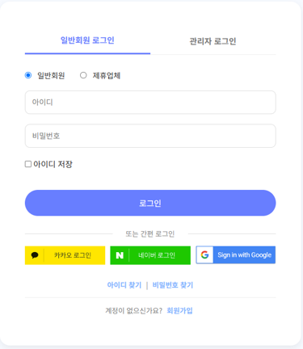
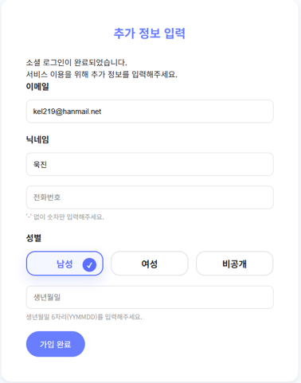
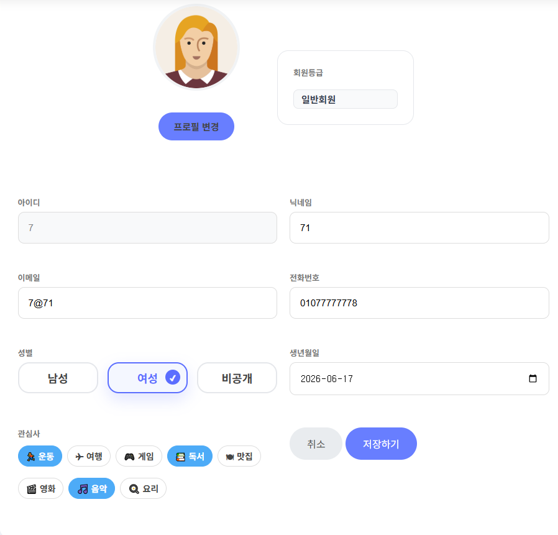
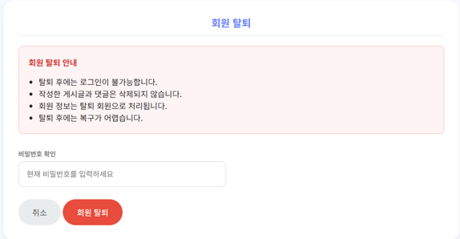

# 🚀 MOIT (모잇)


## 📌 프로젝트 소개

**MOIT(모잇)** 은 스터디, 프로젝트, 운동, 취미 활동 등  
**공통의 관심사와 목표를 가진 사람들이 모임을 만들고 참여할 수 있는 목적형 커뮤니티 플랫폼**입니다.

1차 프로젝트에서 구현한 기본 회원 기능을 바탕으로,  
2차 프로젝트에서는 **Spring Boot 기반으로 프로젝트를 리팩토링하고 Spring Security, OAuth2, BCrypt, Oracle 등을 적용하여 회원 관리 및 인증·보안 기능을 고도화**하였습니다.

---

# 🎯 프로젝트 목표

- 목적 기반 소모임 커뮤니티 서비스 구축
- 회원 관리 기능 구현
- 인증 및 인가 기능 강화
- 비밀번호 보안 강화
- OAuth2 기반 소셜 로그인 구현
- Spring Boot 기반 리팩토링을 통한 유지보수성 개선

---

# 📅 프로젝트 개요

| 항목 | 내용 |
|---|---|
| 프로젝트명 | MOIT (모잇) |
| [1차 개발](https://github.com/kimwookjin219/2026-AI-FULLSTACK/tree/main/moit-project/2026-tjoeun-projects/moit-v1) | 2026.06.16 ~ 2026.06.22<br>**회원가입, 로그인 등 기본 회원관리 기능 구현** |
| 2차 개발 | 2026.07.02 ~ 2026.07.14<br>**회원정보 관리 및 소셜 로그인 기능 확장** |
| 개발 형태 | 팀 프로젝트 |
| 담당 영역 | **회원 관리 · 인증/인가 · 보안** |

---

# 🔄 1차 → 2차 프로젝트 기술 변경

### Framework

- Spring Framework → **Spring Boot**

### Database

- MySQL → **Oracle**

### View

- JSP → **Thymeleaf**

### Security

- **Spring Security 적용**
- **OAuth2 기반 소셜 로그인 추가**
- **BCrypt 비밀번호 암호화 적용**

### Data Access

- **MyBatis 기반 회원 데이터 처리**

---

# 👤 주요 담당 기능

## 1. 회원가입

- 일반 회원가입 기능 구현
- 회원 정보 입력 및 저장
- 회원가입 데이터 검증
- 관심사 정보 등록

---

## 2. 로그인

- 일반 회원 로그인 기능 구현
- Spring Security 기반 인증 처리
- 로그인 사용자 인증 상태 관리
- 회원 유형에 따른 접근 권한 관리

---

## 3. OAuth2 소셜 로그인

- OAuth2 기반 소셜 로그인 구현
- 소셜 로그인 사용자 정보 처리
- 최초 소셜 로그인 사용자 확인
- 최초 로그인 시 추가 정보 입력 처리
- 추가 정보 입력 완료 후 회원 데이터 생성
- 기존 회원과 신규 소셜 회원의 인증 흐름 분리

### 소셜 로그인 Flow

```text
소셜 로그인 요청
      ↓
OAuth2 인증
      ↓
사용자 정보 조회
      ↓
기존 회원 확인
      ↓
 ┌───────────────┐
 │ 기존 회원인가?  │
 └───────┬───────┘
         │
    ┌────┴────┐
    ↓         ↓
   YES        NO
    ↓         ↓
  로그인    추가 정보 입력
              ↓
           회원가입
              ↓
            로그인
```

---

# 🎥 프로젝트 시연

* 회원가입 및 로그인

  * https://youtu.be/_hjCvGfciKc

<details>
<summary>📸 MOIT-V2 화면 보기</summary>

<br>


① 회원가입 — 회원 등록

<br><br>


② 로컬로그인 & 소셜로그인

<br><br>


③ 소셜 로그인 — 추가 회원정보 입력

<br><br>


④ 회원정보 수정

<br><br>


⑤ 회원탈퇴 — Soft Delete

</details>  

---

# 📢 MOIT

**Meet + It = MOIT**

같은 관심사와 목표를 가진 사람들이 연결되어 함께 활동할 수 있도록 지원하는 목적형 커뮤니티 플랫폼입니다.

2차 프로젝트에서는 **Spring Boot 기반 리팩토링과 Spring Security, OAuth2, BCrypt, HIBP API를 적용하여 회원 관리 및 인증·보안 기능을 고도화**하였습니다.