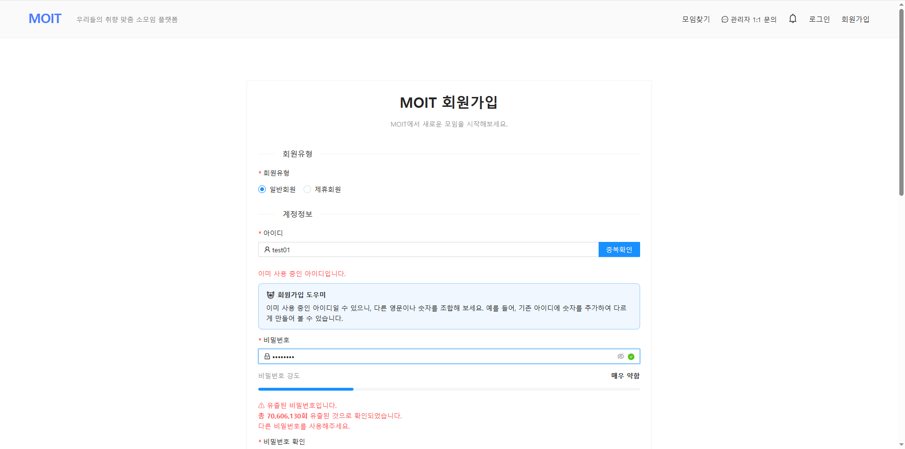
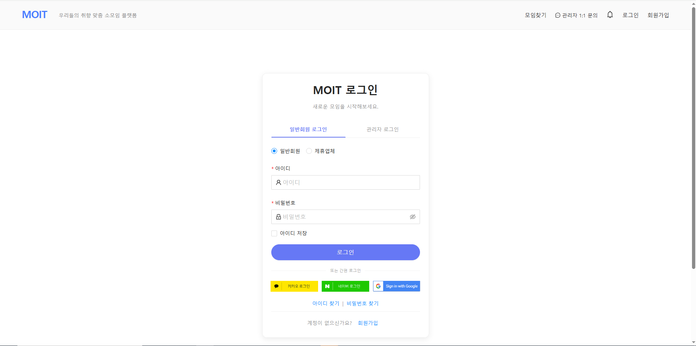
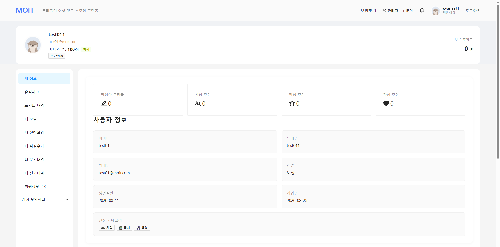
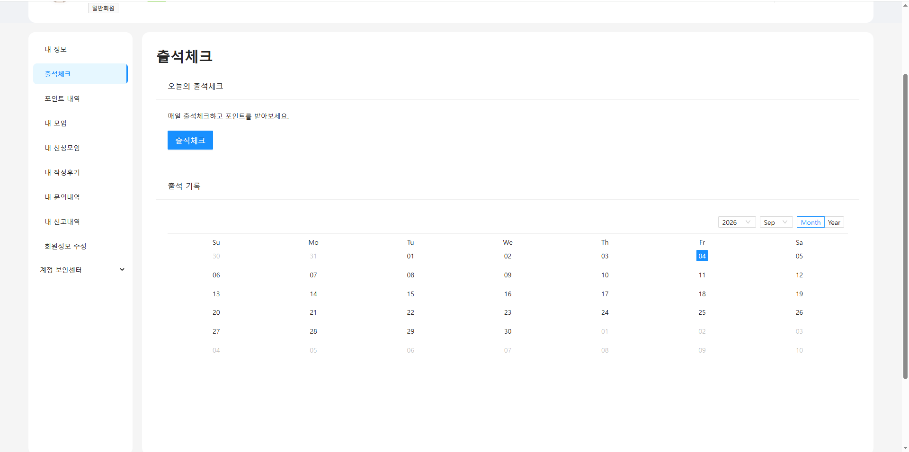
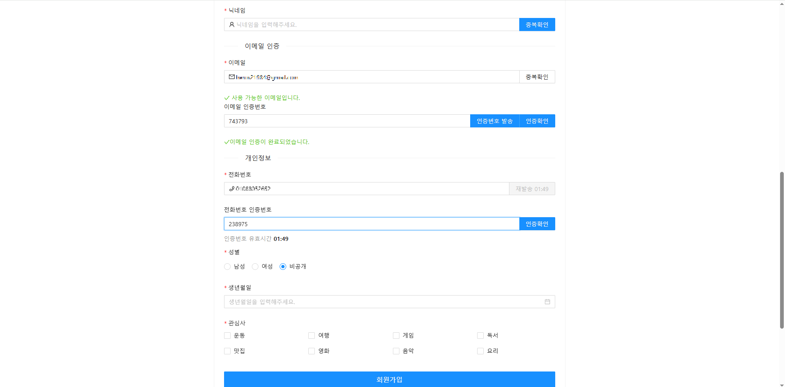
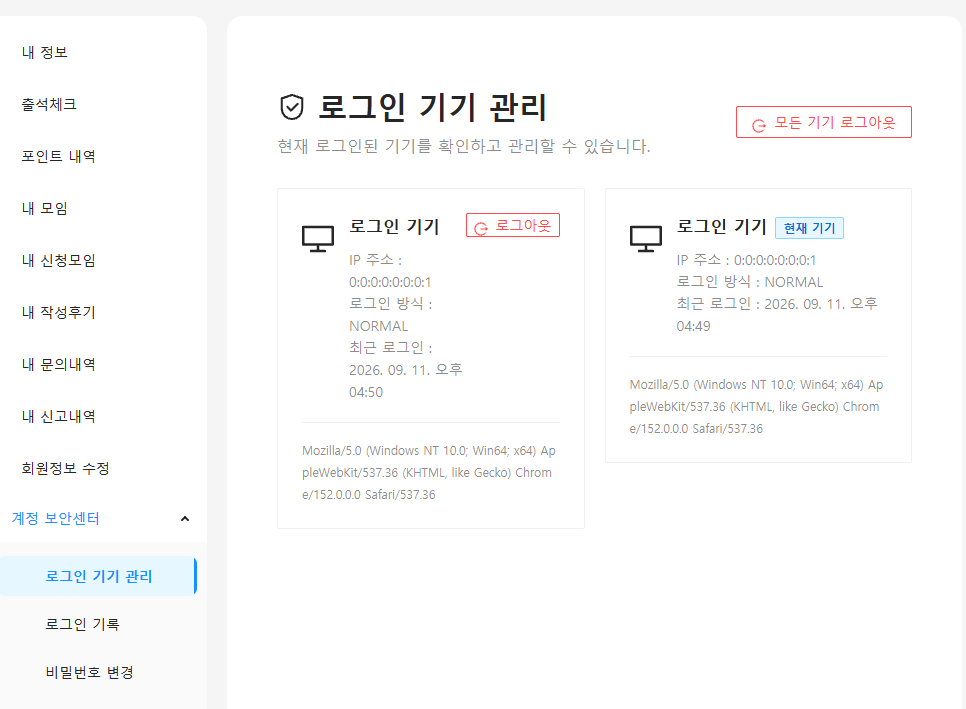
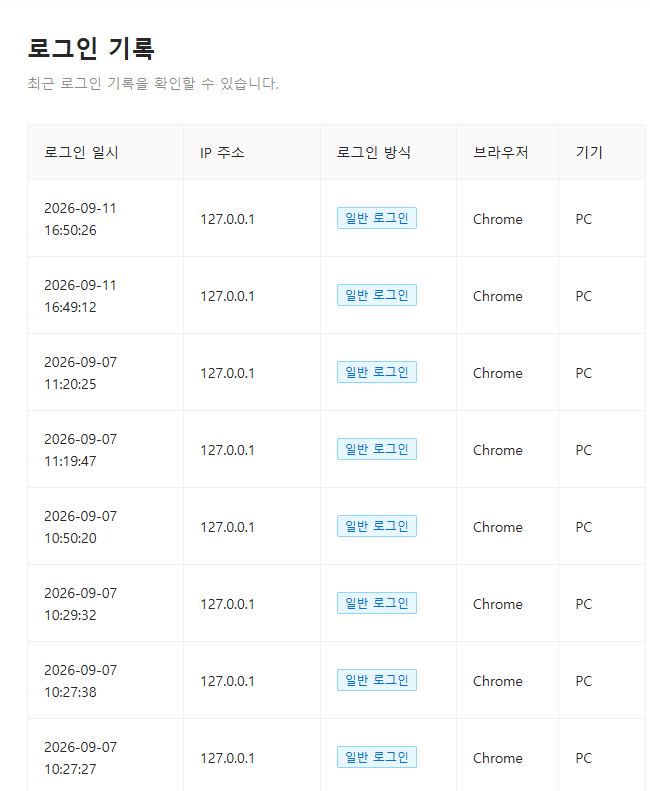
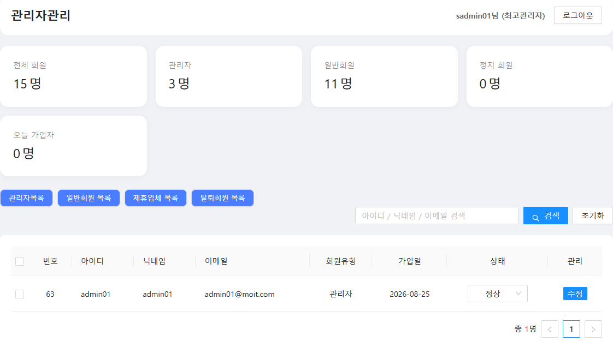

# 🚀 MOIT (모잇)


## 📌 프로젝트 소개

**MOIT(모잇)** 은 스터디, 프로젝트, 운동, 취미 활동 등  
**공통의 관심사와 목표를 가진 사람들이 모임을 만들고 참여할 수 있는 목적형 커뮤니티 플랫폼**입니다.

1차 프로젝트에서 기본적인 소모임 플랫폼을 구축하고,  
2차 프로젝트에서는 Spring Boot 기반으로 리팩토링하며 다양한 Open API와 AI 기능을 도입했습니다.

3차 프로젝트에서는 **Spring Boot 기반 REST API 구조로 전환하고 JPA, MyBatis, JWT, Redis, OAuth2 등을 적용하여 회원관리 및 인증·인가 기능을 고도화**했습니다.

---

# 🎯 프로젝트 목표

- 목적 기반 소모임 커뮤니티 서비스 구축
- 회원가입부터 로그인, 회원정보 관리까지 회원관리 기능 구현
- JWT 기반 인증·인가 및 사용자 권한 관리
- OAuth2 기반 소셜 로그인 연동
- Redis를 활용한 인증 데이터 관리
- 회원정보 및 비밀번호 관련 보안 강화
- REST API 기반 구조로 전환하여 확장성과 유지보수성 향상

---

# 📅 프로젝트 개요

| 항목 | 내용 |
| ----- | ------------------------- |
| 프로젝트명 | MOIT (모잇) ☁ [MOIT AWS](https://moitv3.duckdns.org/) |
| [1차 개발](https://github.com/kimwookjin219/2026-AI-FULLSTACK/tree/main/moit-project/2026-tjoeun-projects/moit-v1) | 2026.06.16 ~ 2026.06.22<br>**회원가입, 로그인 등 기본 회원관리 기능 구현**  |
| [2차 개발](https://github.com/kimwookjin219/2026-AI-FULLSTACK/tree/main/moit-project/2026-tjoeun-projects/moit-v2) | 2026.07.02 ~ 2026.07.14<br>**회원정보 관리 및 소셜 로그인 기능 확장**  |
| 3차 개발 | 2026.08.12 ~ 2026.08.28<br>**JWT·Redis 기반 인증/인가 고도화 및 회원 보안 기능 강화**  |
| 개발 형태 | 팀 프로젝트 |
| 담당 영역 | **회원관리 / 인증·인가 / 보안** |

---

# 🔄 3차 프로젝트 기술 변경

### Framework

- Spring Framework → **Spring Boot**
- Maven → **Gradle**

### Persistence

- MyBatis 중심 구조 → **JPA + MyBatis Hybrid 구조**
- JPA를 활용한 Entity 기반 데이터 관리
- 기존 SQL 기반 기능과 JPA 기반 기능을 목적에 따라 병행

### Database

- MySQL → **Oracle**

### Security

- **Spring Security**
- **JWT Access Token / Refresh Token**
- **Redis 기반 Refresh Token 관리**
- **OAuth2 기반 소셜 로그인**
- 회원 유형별 **인증·인가 및 접근 권한 제어**

### Front-End

- JSP / Thymeleaf → **React + Next.js**
- **Ant Design** UI 컴포넌트 적용

---

# ✨ 주요 기능

## 👤 회원관리

### 회원가입 / 로그인

- 회원가입
- 로그인
- 아이디 중복 확인
- 이메일 인증
- 휴대폰 중복 확인
- 비밀번호 유출 여부 검사
- 로그인 실패 횟수 기반 사용자 행동 분석 연동

### 회원정보 관리

- 내 정보 조회
- 회원정보 수정
- 비밀번호 변경
- 프로필 이미지 변경
- 관심사 등록 및 수정
- 아이디 찾기
- 비밀번호 재설정
- 회원 탈퇴 및 Soft Delete 처리

---

## 🔐 인증·인가

### JWT 인증

- JWT 기반 Access Token 발급
- JWT 기반 Refresh Token 발급
- Access Token 만료 시 Refresh Token을 통한 재발급
- JWT Payload를 활용한 회원 식별
- 로그인 기기별 인증 관리

### Redis

- Refresh Token 저장 및 관리
- Token 재발급을 위한 인증 데이터 관리
- TTL을 활용한 인증 데이터 만료 처리

### Spring Security

- Spring Security 기반 인증·인가 구성
- API URL별 접근 권한 설정
- 회원 유형에 따른 접근 제어
- 일반회원 / 제휴업체 / 관리자 권한 분리

---

## 🌐 OAuth2 소셜 로그인

- OAuth2 기반 소셜 로그인 구현
- 소셜 계정과 기존 회원정보 연동
- 최초 소셜 로그인 사용자의 추가 회원정보 입력 처리
- 추가정보 입력 완료 후 회원 데이터 생성 및 인증 처리

---

## 🛡️ 회원 보안

- BCrypt 기반 비밀번호 암호화
- HIBP(Have I Been Pwned) API를 활용한 비밀번호 유출 여부 검사
- 이메일 인증을 통한 회원가입 검증
- JWT 기반 인증 정보 보호
- 회원 상태에 따른 접근 제한
- Soft Delete를 통한 회원 데이터 관리

---

## 👨‍💼 관리자 회원관리

- 관리자 회원 목록 조회
- 회원 검색
- 회원 유형 확인
- 회원 상태 확인
- 회원 상태 변경
- 관리자 권한에 따른 회원관리 기능 접근 제어
- Super Admin 권한을 통한 주요 회원 상태 관리

---

# 🏗️ 회원관리 시스템 구조

```text
[Next.js]
     ↓
[Axios]
     ↓
[Spring Security]
     ↓
[JWT 인증]
     ↓
[REST Controller]
     ↓
[Service]
     ↓
 ┌───────────────┐
 │ JPA Repository│
 │ MyBatis       │
 └───────────────┘
     ↓
[Oracle]

[Redis]
 └─ Refresh Token / 인증 데이터 관리
```

---

# 🎥 프로젝트 시연

* 회원가입 및 로그인

<a href="https://youtu.be/qLQ4DsPll1A">
  
</a>

> 🎬 이미지를 클릭하면 프로젝트 시연 영상을 확인할 수 있습니다.

<details>
<summary><strong>📸 MOIT-V3 화면 보기</strong></summary>

<br>


① 회원가입 — 회원가입 및 입력 검증, LLM 회원가입 도우미

<br><br>


② 로그인 — 사용자 인증

<br><br>


③ 마이페이지 — 회원정보 관리

<br><br>


④ 출석체크 — 회원 활동 기능

<br><br>


⑤ 이메일 / 전화번호 인증 — 회원정보 검증

<br><br>


⑥ 보안센터 — 로그인 기기 관리

<br><br>


⑦ 로그인 기록 — 접속 이력 관리

<br><br>


⑧ 관리자 회원관리 — 회원 상태 관리

</details>  

---

# 📢 MOIT

**Meet + It = MOIT**

같은 관심사와 목표를 가진 사람들이 연결되어 함께 활동할 수 있도록 지원하는 목적형 커뮤니티 플랫폼입니다.

2차 프로젝트에서는 **Spring Boot 기반 리팩토링과 Spring Security, OAuth2, BCrypt, HIBP API를 적용하여 회원 관리 및 인증·보안 기능을 고도화**하였습니다.

이를 바탕으로 이후 3차 프로젝트에서는 **REST API, JWT, Redis, JPA 등을 활용하여 회원 인증 및 관리 기능을 더욱 확장**​하였습니다.